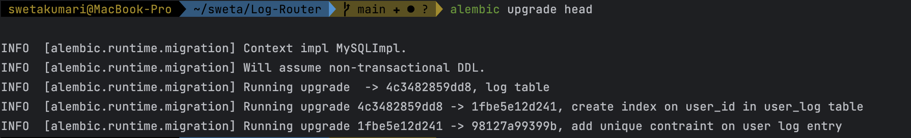

# Log-Router

Log routing <p>
Service to log user events like :-
1. `login`
2. `logout` etc
----
### Step 1. Clone Repo <p>
* Using SSH
```commandline
git clone git@github.com:sweta-chauhan/Log-Router.git
```
* Using HTTPS
```commandline
git clone https://github.com/sweta-chauhan/Log-Router.git
```
* Using GitHub CLI
```commandline
gh repo clone sweta-chauhan/Log-Router
```
----

### Step 2. Installation of Dependency
----
* create virtual env
  ```
  python3 -m venv myenv

* Dependency Installation
  ```
  pip install --upgrade pip wheel
  pip install --upgrade poetry==1.5.0
  poetry config
  poetry config installer.max-workers 28
  poetry install --no-cache

### Step 3. Database Migration/Setup

------
- Setup <p>
```alembic upgrade head``` <p>


---

### Step 4. How to start service
1. Using Docker
   * Create docket-image
     ```
     docker build --no-cache -t log_router:my_app .
   * Running the service use following command
     ```
     docker-compose up app
   * Running the test using following command
     ```
     docker-compose up test

2. Without Using Docker
   * ```
     python entry.py

---
* Curl Call
---
```commandline
curl --location 'http://0.0.0.0:8000/user/log' \
--header 'Content-Type: application/json' \
--data '{
	"id": 1234,
	"unix_ts": 1684129671,
	"user_id": 123456,
	"event_name": "login"
}'
```
---

### Author

---
<b>Sweta Kumari</b> <p>
Date :- 17/06/2023
